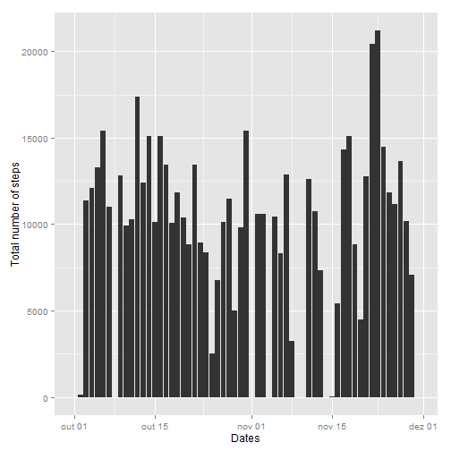
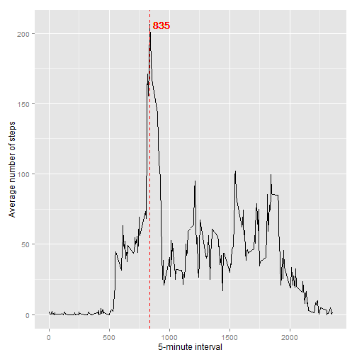
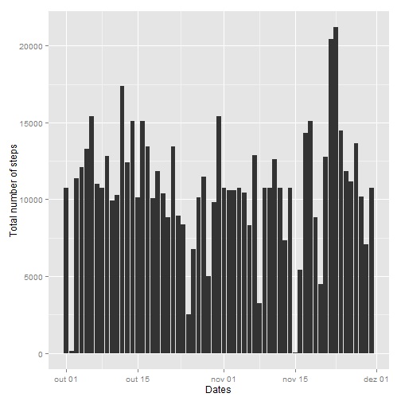
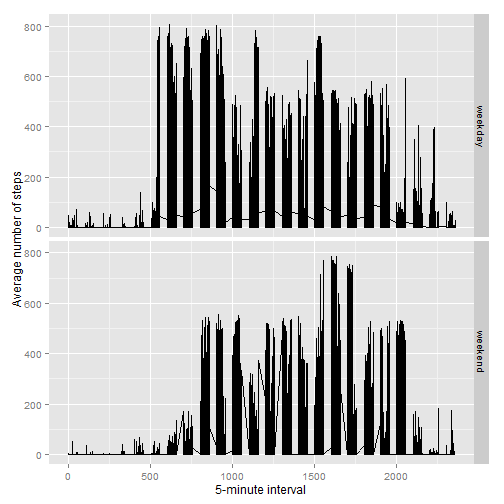

#Reproducible Research: Peer Assessment 1
#Introduction

It is now possible to collect a large amount of data about personal movement using activity monitoring devices such as a Fitbit, Nike Fuelband, or Jawbone Up. These type of devices are part of the "quantified self" movement - a group of enthusiasts who take measurements about themselves regularly to improve their health, to find patterns in their behavior, or because they are tech geeks. But these data remain under-utilized both because the raw data are hard to obtain and there is a lack of statistical methods and software for processing and interpreting the data.

This assignment makes use of data from a personal activity monitoring device. This device collects data at 5 minute intervals through out the day. The data consists of two months of data from an anonymous individual collected during the months of October and November, 2012 and include the number of steps taken in 5 minute intervals each day.

The data for this assignment can be downloaded from the course web site:

Dataset: [Activity monitoring data](https://d396qusza40orc.cloudfront.net/repdata%2Fdata%2Factivity.zip) [52K]

steps: Number of steps taking in a 5-minute interval (missing values are coded as NA) 
date: The date on which the measurement was taken in YYYY-MM-DD format 
interval: Identifier for the 5-minute interval in which measurement was taken 
The dataset is stored in a comma-separated-value (CSV) file and there are a total of 17,568 observations in this dataset. 

##Loading and preprocessing the data:


```r
if(!file.exists("activity.csv")){
    unzip("activity.zip", overwrite=TRUE)
}

activity <- read.csv("activity.csv",na.strings = "NA",sep=",")
activity$date <- as.Date(activity$date)
```

## What is mean total number of steps taken per day?

1. Histogram of the total number of steps taken each day


```r
library(dplyr)
library(ggplot2)
total_byday<-activity%>%
               group_by(date)%>% 
                summarise_each(funs(sum(.,na.rm=TRUE)), steps)

ggplot(data=total_byday, aes(x=date, y=steps)) + geom_histogram(stat="identity") + 
    xlab("Dates") + ylab("Total number of steps") 
```



2. Mean and median total number of steps taken per day


```r
steps_byday<-data.frame(activity%>%
group_by(date)%>% 
    summarise_each(funs(mean(.,na.rm=TRUE), median(.,na.rm=TRUE)), steps))
head(steps_byday,100)
```

```
##          date       mean median
## 1  2012-10-01        NaN     NA
## 2  2012-10-02  0.4375000      0
## 3  2012-10-03 39.4166667      0
## 4  2012-10-04 42.0694444      0
## 5  2012-10-05 46.1597222      0
## 6  2012-10-06 53.5416667      0
## 7  2012-10-07 38.2465278      0
## 8  2012-10-08        NaN     NA
## 9  2012-10-09 44.4826389      0
## 10 2012-10-10 34.3750000      0
## 11 2012-10-11 35.7777778      0
## 12 2012-10-12 60.3541667      0
## 13 2012-10-13 43.1458333      0
## 14 2012-10-14 52.4236111      0
## 15 2012-10-15 35.2048611      0
## 16 2012-10-16 52.3750000      0
## 17 2012-10-17 46.7083333      0
## 18 2012-10-18 34.9166667      0
## 19 2012-10-19 41.0729167      0
## 20 2012-10-20 36.0937500      0
## 21 2012-10-21 30.6284722      0
## 22 2012-10-22 46.7361111      0
## 23 2012-10-23 30.9652778      0
## 24 2012-10-24 29.0104167      0
## 25 2012-10-25  8.6527778      0
## 26 2012-10-26 23.5347222      0
## 27 2012-10-27 35.1354167      0
## 28 2012-10-28 39.7847222      0
## 29 2012-10-29 17.4236111      0
## 30 2012-10-30 34.0937500      0
## 31 2012-10-31 53.5208333      0
## 32 2012-11-01        NaN     NA
## 33 2012-11-02 36.8055556      0
## 34 2012-11-03 36.7048611      0
## 35 2012-11-04        NaN     NA
## 36 2012-11-05 36.2465278      0
## 37 2012-11-06 28.9375000      0
## 38 2012-11-07 44.7326389      0
## 39 2012-11-08 11.1770833      0
## 40 2012-11-09        NaN     NA
## 41 2012-11-10        NaN     NA
## 42 2012-11-11 43.7777778      0
## 43 2012-11-12 37.3784722      0
## 44 2012-11-13 25.4722222      0
## 45 2012-11-14        NaN     NA
## 46 2012-11-15  0.1423611      0
## 47 2012-11-16 18.8923611      0
## 48 2012-11-17 49.7881944      0
## 49 2012-11-18 52.4652778      0
## 50 2012-11-19 30.6979167      0
## 51 2012-11-20 15.5277778      0
## 52 2012-11-21 44.3993056      0
## 53 2012-11-22 70.9270833      0
## 54 2012-11-23 73.5902778      0
## 55 2012-11-24 50.2708333      0
## 56 2012-11-25 41.0902778      0
## 57 2012-11-26 38.7569444      0
## 58 2012-11-27 47.3819444      0
## 59 2012-11-28 35.3576389      0
## 60 2012-11-29 24.4687500      0
## 61 2012-11-30        NaN     NA
```

## What is the average daily activity pattern?

1. Time series plot (i.e. type = "l") of the 5-minute interval (x-axis) and the average number of steps taken, averaged across all days (y-axis)


```r
mean_byinterval<-activity%>%
               group_by(interval)%>% 
                summarise_each(funs(mean(.,na.rm=TRUE)),steps)

max<-mean_byinterval$interval[mean_byinterval$step==max(mean_byinterval$steps)]

ggplot(mean_byinterval, aes(interval, steps)) + geom_line() + 
     xlab("5-minute interval") + ylab("Average number of steps") + 
     geom_vline(xintercept= max,linetype = "dashed", colour = "red") + 
     geom_text(aes(x=max+100, label=max, y=max(mean_byinterval$steps)), colour="red")
```



2. Which 5-minute interval, on average across all the days in the dataset, contains the maximum number of steps?


```r
max
```

```
## [1] 835
```

## Imputing missing values - Using the mean accross all dates by interval

1. Total number of missing values in the dataset (i.e. the total number of rows with NAs)


```r
colSums(is.na(activity))
```

```
##    steps     date interval 
##     2304        0        0
```

2. Fill missing values : 
   Strategy - Use the average number of steps taken, averaged across all days by 5-minute interval
   
3. New dataset that is equal to the original dataset but with the missing data filled in.


```r
activity_noNAs <- activity

for(i in 1:nrow(activity_noNAs)) {
    if (is.na(activity_noNAs[i,]$steps)) {
        activity_noNAs[i,]$steps <- mean_byinterval$steps[mean_byinterval$interval == activity[i,]$interval]
    }
}
```

4. Histogram of the total number of steps taken each day and Calculate and report the mean and median total number of steps taken per day. 


```r
total_byday_noNAs<-activity_noNAs%>%
               group_by(date)%>% 
                summarise_each(funs(sum(.,na.rm=TRUE)), steps)

ggplot(data=total_byday_noNAs, aes(x=date, y=steps)) + geom_histogram(stat="identity") + 
    xlab("Dates") + ylab("Total number of steps") 
```



```r
steps_byday_noNAs<-data.frame(activity_noNAs%>%
group_by(date)%>% 
    summarise_each(funs(mean(.,na.rm=TRUE), median(.,na.rm=TRUE)), steps))
head(steps_byday_noNAs,100)
```

```
##          date       mean   median
## 1  2012-10-01 37.3825996 34.11321
## 2  2012-10-02  0.4375000  0.00000
## 3  2012-10-03 39.4166667  0.00000
## 4  2012-10-04 42.0694444  0.00000
## 5  2012-10-05 46.1597222  0.00000
## 6  2012-10-06 53.5416667  0.00000
## 7  2012-10-07 38.2465278  0.00000
## 8  2012-10-08 37.3825996 34.11321
## 9  2012-10-09 44.4826389  0.00000
## 10 2012-10-10 34.3750000  0.00000
## 11 2012-10-11 35.7777778  0.00000
## 12 2012-10-12 60.3541667  0.00000
## 13 2012-10-13 43.1458333  0.00000
## 14 2012-10-14 52.4236111  0.00000
## 15 2012-10-15 35.2048611  0.00000
## 16 2012-10-16 52.3750000  0.00000
## 17 2012-10-17 46.7083333  0.00000
## 18 2012-10-18 34.9166667  0.00000
## 19 2012-10-19 41.0729167  0.00000
## 20 2012-10-20 36.0937500  0.00000
## 21 2012-10-21 30.6284722  0.00000
## 22 2012-10-22 46.7361111  0.00000
## 23 2012-10-23 30.9652778  0.00000
## 24 2012-10-24 29.0104167  0.00000
## 25 2012-10-25  8.6527778  0.00000
## 26 2012-10-26 23.5347222  0.00000
## 27 2012-10-27 35.1354167  0.00000
## 28 2012-10-28 39.7847222  0.00000
## 29 2012-10-29 17.4236111  0.00000
## 30 2012-10-30 34.0937500  0.00000
## 31 2012-10-31 53.5208333  0.00000
## 32 2012-11-01 37.3825996 34.11321
## 33 2012-11-02 36.8055556  0.00000
## 34 2012-11-03 36.7048611  0.00000
## 35 2012-11-04 37.3825996 34.11321
## 36 2012-11-05 36.2465278  0.00000
## 37 2012-11-06 28.9375000  0.00000
## 38 2012-11-07 44.7326389  0.00000
## 39 2012-11-08 11.1770833  0.00000
## 40 2012-11-09 37.3825996 34.11321
## 41 2012-11-10 37.3825996 34.11321
## 42 2012-11-11 43.7777778  0.00000
## 43 2012-11-12 37.3784722  0.00000
## 44 2012-11-13 25.4722222  0.00000
## 45 2012-11-14 37.3825996 34.11321
## 46 2012-11-15  0.1423611  0.00000
## 47 2012-11-16 18.8923611  0.00000
## 48 2012-11-17 49.7881944  0.00000
## 49 2012-11-18 52.4652778  0.00000
## 50 2012-11-19 30.6979167  0.00000
## 51 2012-11-20 15.5277778  0.00000
## 52 2012-11-21 44.3993056  0.00000
## 53 2012-11-22 70.9270833  0.00000
## 54 2012-11-23 73.5902778  0.00000
## 55 2012-11-24 50.2708333  0.00000
## 56 2012-11-25 41.0902778  0.00000
## 57 2012-11-26 38.7569444  0.00000
## 58 2012-11-27 47.3819444  0.00000
## 59 2012-11-28 35.3576389  0.00000
## 60 2012-11-29 24.4687500  0.00000
## 61 2012-11-30 37.3825996 34.11321
```

4. 1 Do these values differ from the estimates from the first part of the assignment?


```r
steps_bind <- cbind(steps_byday, steps_byday_noNAs)
names(steps_bind) <- c("before_date","before_mean","before_median","after_date","after_mean","after_median")
steps_diff <- steps_bind$before_mean != steps_bind$after_mean | steps_bind$before_median != steps_bind$after_median
steps_bind[is.na(steps_diff) | steps_diff,]
```

```
##    before_date before_mean before_median after_date after_mean
## 1   2012-10-01         NaN            NA 2012-10-01    37.3826
## 8   2012-10-08         NaN            NA 2012-10-08    37.3826
## 32  2012-11-01         NaN            NA 2012-11-01    37.3826
## 35  2012-11-04         NaN            NA 2012-11-04    37.3826
## 40  2012-11-09         NaN            NA 2012-11-09    37.3826
## 41  2012-11-10         NaN            NA 2012-11-10    37.3826
## 45  2012-11-14         NaN            NA 2012-11-14    37.3826
## 61  2012-11-30         NaN            NA 2012-11-30    37.3826
##    after_median
## 1      34.11321
## 8      34.11321
## 32     34.11321
## 35     34.11321
## 40     34.11321
## 41     34.11321
## 45     34.11321
## 61     34.11321
```

4. 2 What is the impact of imputing missing data on the estimates of the total daily number of steps?


```r
total_bind <- cbind(total_byday, total_byday_noNAs)
names(total_bind) <- c("before_date","before_steps","after_date","after_steps")
total_diff <- total_bind$before_steps != total_bind$after_steps
total_bind[is.na(total_diff) | total_diff,]
```

```
##    before_date before_steps after_date after_steps
## 1   2012-10-01            0 2012-10-01    10766.19
## 8   2012-10-08            0 2012-10-08    10766.19
## 32  2012-11-01            0 2012-11-01    10766.19
## 35  2012-11-04            0 2012-11-04    10766.19
## 40  2012-11-09            0 2012-11-09    10766.19
## 41  2012-11-10            0 2012-11-10    10766.19
## 45  2012-11-14            0 2012-11-14    10766.19
## 61  2012-11-30            0 2012-11-30    10766.19
```

## Are there differences in activity patterns between weekdays and weekends?

1. New factor variable in the dataset with two levels - "weekday" and "weekend" indicating whether a given date is a weekday or weekend day.


```r
activity_noNAs<-mutate(activity_noNAs,weekday=
                 ifelse (as.POSIXlt(date)$wday %in% c(0,6),"weekend","weekday"))
```

2. Panel plot containing a time series plot (i.e. type = "l") of the 5-minute interval (x-axis) and the average number of steps taken, averaged across all weekday days or weekend days (y-axis). 


```r
mean_byinterval<-activity_noNAs%>%
               group_by(interval)%>% 
                summarise_each(funs(mean(.,na.rm=TRUE)),steps)


ggplot(activity_noNAs, aes(x=interval, y=steps)) + geom_line() + 
    facet_grid(weekday ~ .) + xlab("5-minute interval") + ylab("Average number of steps") 
```


